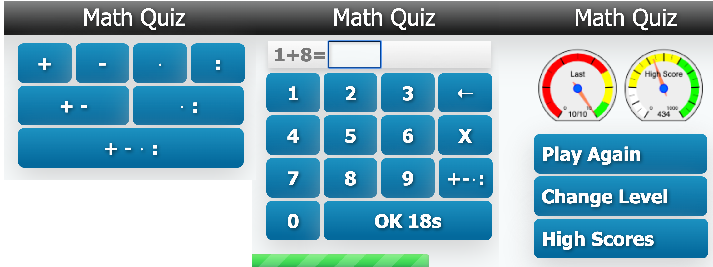

# mathquiz 1

An early (late 2011) experiment of a browser application (aka single page
application) combined with a java backend. It uses XHTML, JSF and Javascript
for the frontend. The application is supposed to be kid friendly, usable on
a mobile device and to scale to any screen size.



## build
```
mvn clean package
```

## run
```
mvn jetty:run -Djetty.http.port=9999
```

## play
http://localhost:9999/
 
## run standalone
```
java -jar run/jetty-runner-*.jar --port 9999 target/mathquiz1.war
```

## requirements
### earliest spec tested:

> Apache Maven 3.3.9 (bb52d8502b132ec0a5a3f4c09453c07478323dc5; 2015-11-10T16:41:47+00:00)  
> Java version: 1.8.0_201, vendor: Oracle Corporation  
> OS name: "linux", version: "4.15.0-96-generic", arch: "amd64", family: "unix"  

### latest spec tested:

> Apache Maven 3.6.3 (cecedd343002696d0abb50b32b541b8a6ba2883f)  
> Java version: 15-ea, vendor: Oracle Corporation  
> OS name: "mac os x", version: "10.15.3", arch: "x86_64", family: "mac"  

## tools

In order to install jdk and maven the following tool has been used:
https://sdkman.io/
